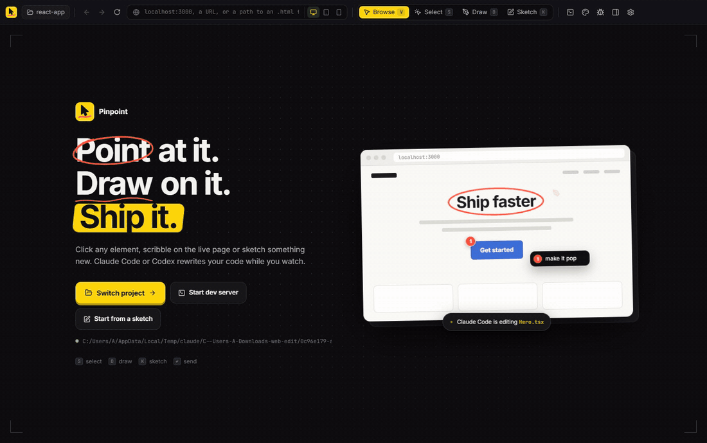
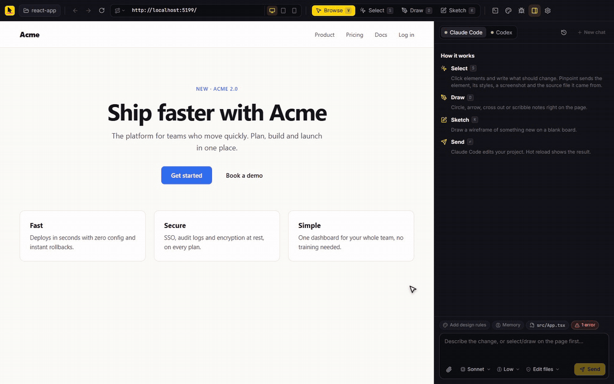
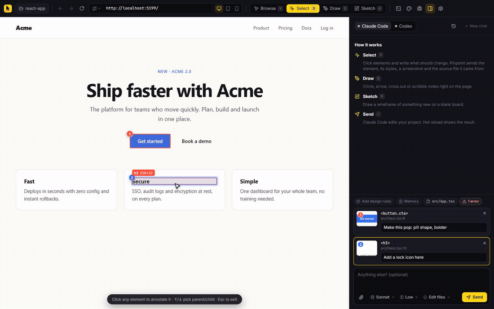
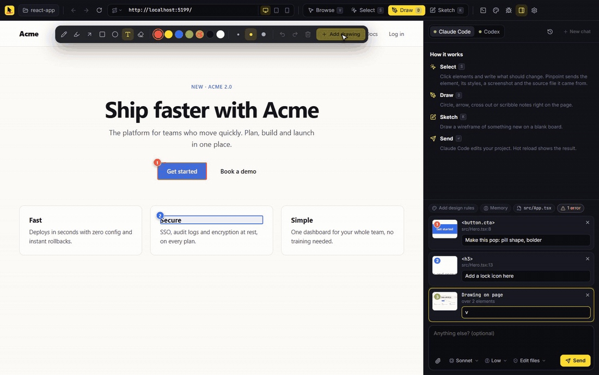
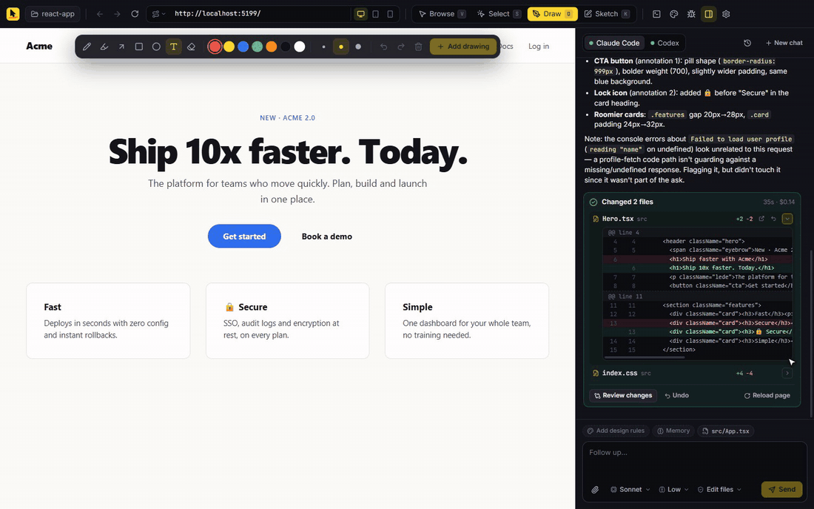
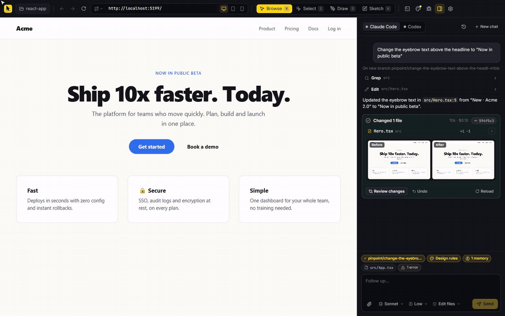
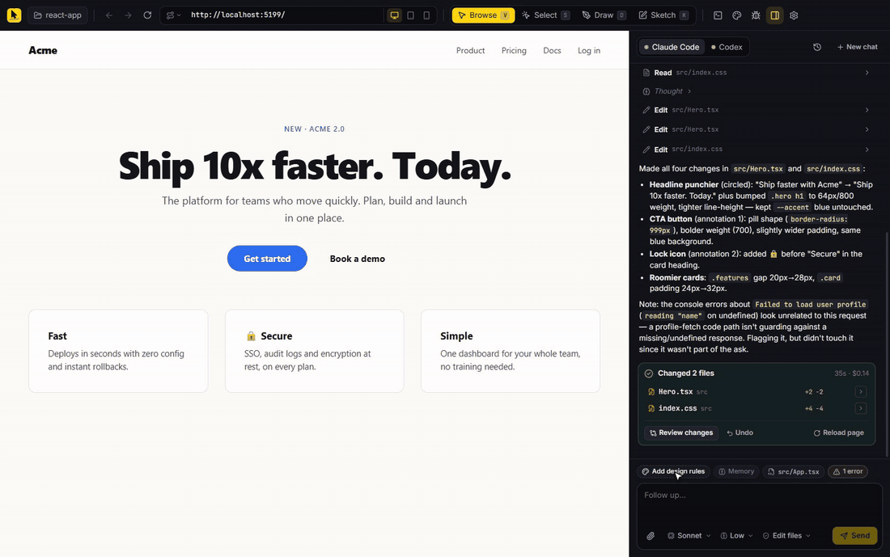

<div align="center">


# Pinpoint

**Point at it. Draw on it. Ship it.**

A desktop visual editor for your web app. Click elements, scribble on the live page or sketch something new,<br />
and Claude Code or Codex rewrites your code while you watch.

[](https://github.com/m-ahmed-elbeskeri/pinpoint/actions/workflows/ci.yml)
[](https://github.com/m-ahmed-elbeskeri/pinpoint/releases/latest)
[](LICENSE)


[**Download**](https://github.com/m-ahmed-elbeskeri/pinpoint/releases/latest) · [How it works](#how-it-works) · [Build from source](#build-from-source) · [Contributing](CONTRIBUTING.md)

<br />



</div>

<br />

## Why Pinpoint

Describing UI changes in words is slow and lossy. "Make the second button on the pricing page a bit less loud" turns into a guessing game for any coding agent.

Pinpoint lets you **show** instead. It opens your running site in a real browser, lets you point at and draw on exactly what you mean, and hands the agent everything it needs: screenshots, the exact element, its styles, and the source file and line it came from. Then it shows you exactly what changed and lets you take any of it back.

It works with the coding agent you already use. There's no new account, API key or server.

<br />

## Point at it

Press <kbd>S</kbd> and click any element. A numbered pin lands on the page and a note box opens right there. Pinpoint captures the selector, computed styles, a close-up screenshot and **the source file and line**. It reads React, Vue, Svelte, Astro and Angular dev metadata, and follows your dev server's source maps for exact lines even on React 19.



<br />

## Draw on it

Press <kbd>D</kbd> to mark up the live page like a design review: circle things, draw arrows, cross things out, write notes. Pinpoint flattens your markup onto a screenshot and also works out which elements sit under your strokes. Press <kbd>K</kbd> instead for a blank whiteboard to sketch something new.



<br />

## Ship it

Hit <kbd>Enter</kbd>. The agent's reply streams in as it works and your dev server hot-reloads the result. You can **steer mid-run**: <kbd>Enter</kbd> sends a message that lands right after the agent's current step, and <kbd>Ctrl</kbd>/<kbd>⌘</kbd>+<kbd>Enter</kbd> interrupts and redirects immediately.

When it finishes you get the real list of changed files, however the agent edited them, each with its line counts and an inline diff.



<br />

## Review and undo anything

Open the full diff viewer for any run, revert a single file or undo the whole run. Every run keeps before and after copies in `.pinpoint/runs/`, so undo still works after you restart. If you or a later run edited a file since, Pinpoint warns you before overwriting it.



<br />

## See the difference

Every run that changes the open page gets a **before and after** screenshot. Drag the slider across them, view them side by side, or switch to **Changes** to see exactly which pixels moved. **Check all sizes** captures the result at phone, tablet and desktop widths so you catch responsive breakage before it ships.



<br />

## Ship it through git

Click the branch chip above the composer:

- **New branch for each chat:** every new conversation starts on its own `pinpoint/...` branch.
- **Commit after each run:** Pinpoint commits exactly the files the agent changed, never your other work, with a message written from what you asked for.
- **Open PR:** pushes the branch and opens a pull request with your GitHub CLI login. The description is drafted from the chat: what you asked for, which files changed and the commits.

Not a git repo yet? The same menu can initialize one. Runs that weren't auto-committed get a **Commit** button on their card.

<br />

## Teach it your taste

- **Design rules:** a `DESIGN.md` at your project root with your colors, type, spacing and components. Click **Draft from page** and Pinpoint reads them off your rendered site, CSS variables included. It's sent at the start of each chat and lives in your repo, so your team shares it.
- **Memory:** short rules sent with every request, like "buttons are always pill-shaped". When you state a preference in chat, the agent offers to remember it.



<br />

## Everything else

| | |
|---|---|
| **Page problems** | Console errors, failed network requests and dev-server errors show up as a chip. Send them along or hit **Ask to fix**. |
| **Reference images** | Paste, drag in or attach mockups and screenshots, each with its own note. |
| **Routes** | Pinpoint finds your pages (Next.js, Astro, Nuxt, SvelteKit, Remix, React Router, plain HTML) and tells the agent which file renders the current one. |
| **Models and access** | Pick the model and thinking level per agent, and how much the agent may do: **Plan only**, **Edit files** or **Full access**. |
| **Chat history** | Conversations are saved per project and reopen where you left off. |
| **Git** | Branch per chat, commit per run, and pull requests through the GitHub CLI (`gh`). |
| **Dev server** | Start your dev server from the built-in terminal. Pinpoint opens the URL it prints. |
| **Responsive** | Switch between desktop, tablet and phone widths from the URL bar. |

<br />

## Install

Download the latest build from **[Releases](https://github.com/m-ahmed-elbeskeri/pinpoint/releases/latest)**:

| Platform | File | Notes |
|---|---|---|
| Windows | `Pinpoint-x.y.z-win-x64.exe` | Installer |
| macOS | `Pinpoint-x.y.z-mac-arm64.dmg` / `-x64.dmg` | Apple Silicon / Intel. Builds are unsigned for now, so the first time right-click the app and choose **Open**. |
| Linux | `Pinpoint-x.y.z-linux-x86_64.AppImage` | `chmod +x` it, then run it |

You also need at least one agent installed and signed in:

- [Claude Code](https://docs.claude.com/en/docs/claude-code): `npm install -g @anthropic-ai/claude-code`, then run `claude` once to sign in.
- [Codex](https://github.com/openai/codex): `npm install -g @openai/codex`, then run `codex` once to sign in.

## Quick start

1. **Open project** (top left) and pick your web app's folder.
2. Start its dev server from the terminal icon, or type its URL in the address bar (for example `localhost:5173`).
3. Press <kbd>S</kbd>, click something, write what should change, and press <kbd>Enter</kbd>.

### Keyboard shortcuts

| Key | Action |
|---|---|
| <kbd>V</kbd> <kbd>S</kbd> <kbd>D</kbd> <kbd>K</kbd> | Browse, Select, Draw, Sketch |
| <kbd>↑</kbd> / <kbd>↓</kbd> | In Select mode: pick the parent / child element |
| <kbd>P</kbd> <kbd>H</kbd> <kbd>A</kbd> <kbd>R</kbd> <kbd>O</kbd> <kbd>T</kbd> <kbd>E</kbd> | In Draw mode: pen, highlighter, arrow, box, circle, text, eraser |
| <kbd>Enter</kbd> | Send (or steer, while the agent is working) |
| <kbd>Ctrl</kbd>/<kbd>⌘</kbd> + <kbd>Enter</kbd> | Interrupt the agent and send now |
| <kbd>Ctrl</kbd>/<kbd>⌘</kbd> + <kbd>Z</kbd> | Undo a stroke |
| <kbd>Ctrl</kbd>/<kbd>⌘</kbd> + <kbd>B</kbd> | Toggle the sidebar |

<br />

## How it works

```
 your clicks, drawings, notes           Pinpoint (Electron)                        your agent CLI
 ───────────────────────────    ────────────────────────────────────    ───────────────────────────────
 embedded browser (webview) ──▶ element info, screenshots, source    ──▶ claude -p --input-format stream-json
                                file:line, console/network errors,       codex app-server (JSON-RPC)
                                route, DESIGN.md, memory                  edits files in your project
                                          │                                          │
                                snapshot before the run ◀── diff after ◀──────────────┘
                                          │
                                changed files, inline diffs, revert
```

- **The browser** is a sandboxed Electron `<webview>`. An isolated preload draws the hover box and numbered pins; framework metadata (React fiber, Vue instances, Svelte meta) is read from the page's own world.
- **The prompt** includes each annotation with its screenshot path, selector, styles, trimmed HTML and source location, plus the overview screenshot, route, diagnostics, memory and (at the start of a chat) your design rules.
- **The agents** run as live sessions so you can steer them: Claude Code over `stream-json` on stdin and stdout, Codex over its app-server protocol (`turn/steer`, `turn/interrupt`). Older Codex versions fall back to `codex exec`.
- **Change tracking** doesn't trust the agent's own report. Pinpoint snapshots the project before each run and diffs it afterwards, so edits made through shell commands are caught too.

Everything Pinpoint writes goes into `.pinpoint/` in your project (it ignores itself in git), except `DESIGN.md`, which is yours to commit.

<br />

## Build from source

Requires Node.js 22+.

```bash
git clone https://github.com/m-ahmed-elbeskeri/pinpoint.git
cd pinpoint
npm install
npm run dev          # Vite + Electron, with hot reload for the UI
```

| Script | What it does |
|---|---|
| `npm run dev` | Run in development |
| `npm start` | Production build, run locally |
| `npm run typecheck` | TypeScript check |
| `npm run dist:win` / `dist:mac` / `dist:linux` | Build installers into `release/` |
| `npm run icons` | Re-render the app icons from `build/icon.svg` |

Releases are built by GitHub Actions: pushing a `v*` tag builds every platform and publishes a GitHub Release. See [CONTRIBUTING.md](CONTRIBUTING.md).

<br />

## FAQ

**Does my code leave my machine?**
Only through the agent you choose, exactly as when you use Claude Code or Codex in a terminal. Pinpoint has no server and no telemetry. See [SECURITY.md](SECURITY.md).

**Which frameworks work?**
Anything that runs in a browser. Source-file lookup is best with React, Vue, Svelte, Astro and Angular dev builds. For anything else the agent finds the code from the selector, text and HTML.

**Can I use it on a site that isn't mine?**
You can browse and mark up any URL, but the agent edits the project folder you opened, so changes only make sense for your own code.

**Why a desktop app and not a browser extension?**
A desktop app can run your coding agent locally, read and restore your files, take pixel-accurate screenshots and host your dev server, all without a backend.

<br />

## Contributing

Issues and pull requests are welcome. Start with [CONTRIBUTING.md](CONTRIBUTING.md), and please follow the [code of conduct](CODE_OF_CONDUCT.md).

## License

[MIT](LICENSE)
